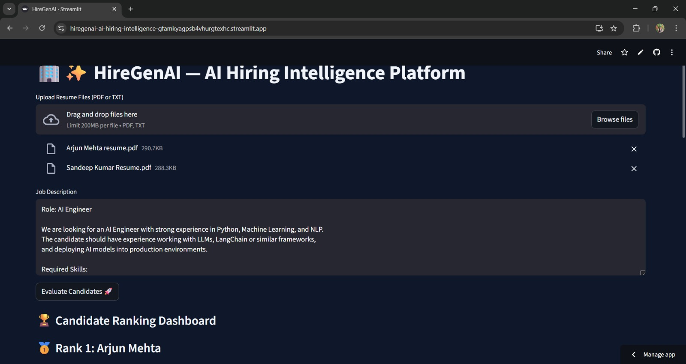
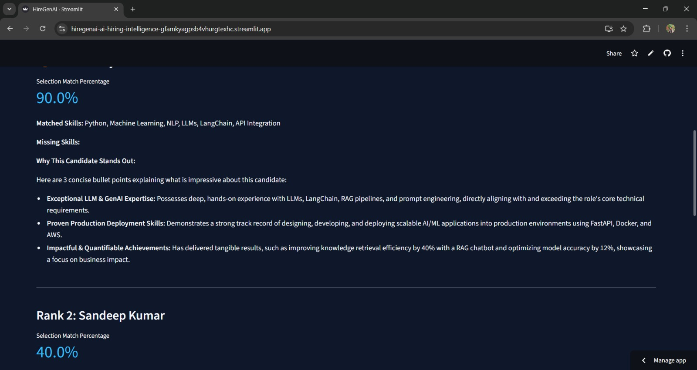
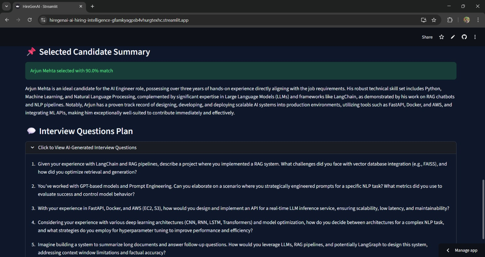

# 🏢 HireGenAI — AI Hiring Intelligence Platform

A sophisticated multi-agent recruitment pipeline built with **LangGraph**, **Google Gemini 2.5 Flash**, and **Streamlit**. **HireGenAI** automates the heavy lifting of talent acquisition by parsing resumes, analyzing job descriptions, and generating personalized interview strategies.

---

## 🚀 Features

- [cite_start]📄 **Resume Parser** — Extracts structured data (Skills, Experience, Education) from PDF/TXT files[cite: 1].
- [cite_start]🎯 **JD Analyzer** — Breaks down job descriptions into required skills and minimum experience[cite: 1].
- [cite_start]⚖️ **Hybrid Scorer** — Ranks candidates using a weighted formula: $60\%$ Skills + $30\%$ Experience + $10\%$ Education[cite: 1].
- [cite_start]💡 **AI Insights** — Generates 3 concise bullet points explaining why a candidate stands out[cite: 1].
- [cite_start]💬 **Interview Architect** — Crafts 5 tailored technical questions based on the candidate's specific background[cite: 1].
- [cite_start]🎨 **Professional Dark UI** — Elegant, high-contrast interface designed for HR productivity[cite: 1].

---

## 🛠️ Tech Stack

| Tool | Purpose |
|------|---------|
| [Streamlit](https://streamlit.io/) | [cite_start]Web UI & Dashboard [cite: 1] |
| [LangGraph](https://github.com/langchain-ai/langgraph) | [cite_start]Multi-agent state machine orchestration [cite: 1] |
| [Google Gemini 2.5 Flash](https://ai.google.dev/) | [cite_start]LLM powering extraction and reasoning [cite: 1] |
| [Pydantic](https://docs.pydantic.dev/) | [cite_start]Structured data validation and output parsing [cite: 1] |
| [PyPDF2](https://pypdf2.readthedocs.io/) | [cite_start]PDF text extraction engine [cite: 1] |
| [LangChain](https://www.langchain.com/) | [cite_start]LLM integration framework [cite: 1] |

---

## 🧠 Agent Pipeline

The system uses a sequential **StateGraph** to ensure data flows accurately from raw files to final interview questions:

[Resume & JD Input]
│
▼
[Resume Parser Node] ──► Structured JSON Data
│
▼
[JD Analyzer Node]   ──► Extraction of Requirements
│
▼
[Matching Agent]     ──► Calculates Match & Missing Skills
│
▼
[Interview Agent]    ──► Generates 5 Custom Questions
│
▼
[Hybrid Scorer]      ──► Final Ranking (Skill/Exp/Edu)


---

## 📦 Installation & Setup

### 1. Clone the repository
```bash
git clone [https://github.com/your-username/HireGenAI.git](https://github.com/your-username/HireGenAI.git)
cd HireGenAI
2. Install dependencies
Bash
pip install -r requirements.txt
3. Environment Configuration
Create a .env file in the root directory:

Code snippet
GOOGLE_API_KEY=your_gemini_api_key_here
4. Run the App
Bash
streamlit run app.py
📁 Project Structure
HireGenAI/
│
├── app.py               # Main application & LangGraph logic
├── requirements.txt     # Python dependencies
├── .env                 # API Keys (Hidden)
└── outputs/             # Application screenshots
    ├── 1.jpeg           
    ├── 2.jpeg           
    └── 3.jpeg           
📸 Outputs
1. Dashboard & File Upload


2. Candidate Ranking & Insights


3. Interview Plan & Summary


📄 License
This project is open-source and available under the MIT License.


I'm ready for your second reference! Feel free to send it over so I can further refine the